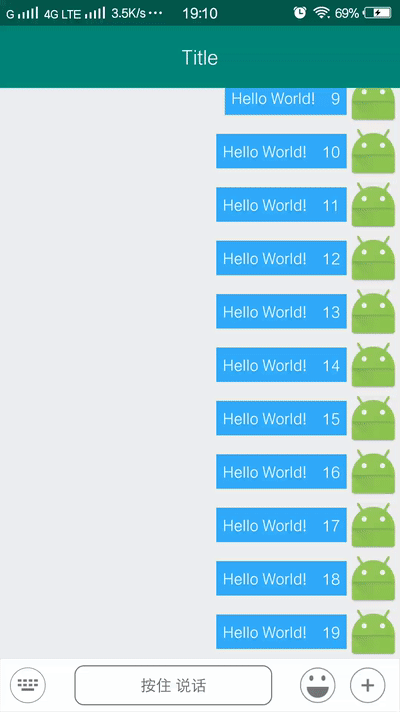

## MyAndroidFrameWork
> <a href="https://github.com/actor20170211030627/MyAndroidFrameWork" target="_blank">Github</a>, 
> <a href="https://gitee.com/actor20170211030627/MyAndroidFrameWork" target="_blank">Gitee码云</a>
>
> 注意: 这是 <b>Androidx</b> 版, 非Androidx版本在&nbsp;
> <a style="font-size:23px" href="./README-1.4.1.md"><s>这儿 </s></a>
> &nbsp;(非Androidx版本不再维护)  
>
> > Androidx版本能很好向下兼容, 包括jar包依赖也能自动转换, 所以建议转换成Androidx.

## 安卓常用组件&框架(懒得每次都搭架子...)
### 1.集成框架包括如下列表, 具体见 <a href="library/build.gradle" target="_blank">build.gradle</a>:
<pre>
<ol><li>//https://github.com/square/okhttp
api "com.squareup.okhttp3:okhttp:4.9.3"
</li>
<li>//https://github.com/google/gson
//不混淆解析类, 示例: -keep class com.package.xxx.info.** { *; }
api 'com.google.code.gson:gson:2.10.1'
</li>
<li>//https://github.com/bumptech/glide
api 'com.github.bumptech.glide:glide:4.12.0'
</li>
<li>//https://github.com/Blankj/AndroidUtilCode 许多工具
api 'com.blankj:utilcodex:1.31.1'
</li>
<li>//https://github.com/CymChad/BaseRecyclerViewAdapterHelper
api 'com.github.CymChad:BaseRecyclerViewAdapterHelper:3.0.7'
</li>
<li>//https://github.com/getActivity/XXPermissions 轮子哥权限
api 'com.github.getActivity:XXPermissions:18.6'
</li>
<li>// 吐司框架：https://github.com/getActivity/Toaster  轮子哥吐司
api 'com.github.getActivity:Toaster:12.6'
</li>
<li>// Shape 框架：https://github.com/getActivity/ShapeView 轮子哥
api 'com.github.getActivity:ShapeView:9.0'
</li>
<li>//https://github.com/getActivity/EasyHttp 轮子哥网络请求框架
api 'com.github.getActivity:EasyHttp:12.8'
</li>
<li>// 腾讯 MMKV：https://github.com/Tencent/MMKV (EasyHttp缓存需要)
api ('com.tencent:mmkv-static:1.3.2') {
    // 避免版本不一致导致的依赖冲突，从而导致编译报错
    exclude group: 'androidx.annotation', module: 'annotation'
}
</li>
<li>//https://github.com/li-xiaojun/XPopup 各种Dialog & Popup (compileSdkVersion 29)
api 'com.github.li-xiaojun:XPopup:2.9.19'
</li></ol>
</pre>

## 2.一些控件和工具类等
**2.1.ViewPager的Adapter**
<pre>
<a href="library/src/main/java/com/actor/myandroidframework/adapter_viewpager/BaseFragmentPagerAdapter.java" target="_blank">BaseFragmentPagerAdapter</a>
<a href="library/src/main/java/com/actor/myandroidframework/adapter_viewpager/BaseFragmentStatePagerAdapter.java" target="_blank">BaseFragmentStatePagerAdapter</a>
<a href="library/src/main/java/com/actor/myandroidframework/adapter_viewpager/BasePagerAdapter.java" target="_blank">BasePagerAdapter</a>
</pre>

**2.2.Dialog(继承对应Dialog并自定义界面, 不用再关注style等. )**
<pre>
<a href="library/src/main/java/com/actor/myandroidframework/dialog/BaseAlertDialog.java" target="_blank">BaseAlertDialog</a> (AlertDialog简单说明)
<a href="library/src/main/java/com/actor/myandroidframework/dialog/BaseBottomSheetDialog.java" target="_blank">BaseBottomSheetDialog</a> (从底部弹出并停留底部, 可二次滑动)
<a href="library/src/main/java/com/actor/myandroidframework/dialog/BaseDialog.java" target="_blank">BaseDialog</a> (Dialog简单封装)
<a href="library/src/main/java/com/actor/myandroidframework/dialog/LoadingDialog.java" target="_blank">LoadingDialog</a> (加载Dialog, 耗时操作时可显示这个Dialog)
<a href="library/src/main/java/com/actor/myandroidframework/dialog/ViewBindingDialog.java" target="_blank">ViewBindingDialog</a> (可以使用viewBinding)
<a href="library/src/main/java/com/actor/myandroidframework/fragment/BaseDialogFragment.java" target="_blank">BaseDialogFragment</a> (dialog样式的Fragment)
</pre>

**2.3.Utils工具类**
<pre>
<a href="library/src/main/java/com/actor/myandroidframework/utils/audio/AudioUtils.java" target="_blank">AudioUtils</a> (录音/播放音频)
<a href="library/src/main/java/com/actor/myandroidframework/utils/database/GreenDaoUtils.java" target="_blank">GreenDaoUtils</a> (GreenDao数据库)
<a href="library/src/main/java/com/actor/myandroidframework/utils/easyhttp/EasyHttpConfigUtils.java" target="_blank">EasyHttpConfigUtils</a> (EasyHttp基本配置 & 封装的WebSocket)
<a href="library/src/main/java/com/actor/myandroidframework/utils/gson/IntJsonDeserializer.java" target="_blank">IntJsonDeserializer</a> (解决Gson""转换成int报错)
<a href="library/src/main/java/com/actor/myandroidframework/utils/okhttputils/OkHttpConfigUtils.java" target="_blank">OkHttpConfigUtils</a> (OkHttp基本配置)
<a href="library/src/main/java/com/actor/myandroidframework/utils/sharedelement/SharedElementUtils.java" target="_blank">SharedElementUtils</a> (元素共享跳转页面)
<a href="library/src/main/java/com/actor/myandroidframework/utils/video/VideoProcessorUtils.java" target="_blank">VideoProcessorUtils</a> (视频压缩)
<a href="library/src/main/java/com/actor/myandroidframework/utils/AssetsUtils.java" target="_blank">AssetsUtils</a> (Assets读取)
<a href="library/src/main/java/com/actor/myandroidframework/utils/Base64Utils.java" target="_blank">Base64Utils</a> (Base64编解码)
<a href="library/src/main/java/com/actor/myandroidframework/utils/BaseCountDownTimer.java" target="_blank">BaseCountDownTimer</a> (倒计时, 可暂停, 继续, 获取计时时间)
<a href="library/src/main/java/com/actor/myandroidframework/utils/BRVUtils.java" target="_blank">BRVUtils</a> (BaseRecyclerView框架辅助)
<a href="library/src/main/java/com/actor/myandroidframework/utils/ClickUtils2.java" target="_blank">ClickUtils2</a> (防止2次点击)
<a href="library/src/main/java/com/actor/myandroidframework/utils/LogUtils.java" target="_blank">LogUtils</a> (Log简单打印)
<a href="library/src/main/java/com/actor/myandroidframework/utils/MMKVUtils.java" target="_blank">MMKVUtils</a> (数据缓存)
<a href="library/src/main/java/com/actor/myandroidframework/utils/NotificationUtils2.java" target="_blank">NotificationUtils2</a> (通知栏)
<a href="library/src/main/java/com/actor/myandroidframework/utils/SPUtils.java" target="_blank"><s>SPUtils</s></a> (<s>SP工具</s>, 建议使用<code>MMKVUtils</code>)
<a href="library/src/main/java/com/actor/myandroidframework/utils/TextUtils2.java" target="_blank">TextUtils2</a> (获取Text, 判空, getStringFormat, ...)
<a href="library/src/main/java/com/actor/myandroidframework/utils/ThreadUtils.java" target="_blank">ThreadUtils</a> (线程判断/切换)
<a href="library/src/main/java/com/actor/myandroidframework/utils/ToasterUtils.java" target="_blank">ToasterUtils</a> (吐司工具类-轮子哥)
</pre>

**2.4.Widget小控件**
<pre>
<a href="library/src/main/java/com/actor/myandroidframework/widget/viewpager/AutoCaculateHeightViewpager.java" target="_blank">AutoCaculateHeightViewpager</a> (自动计算子类高度的ViewPager)
<a href="library/src/main/java/com/actor/myandroidframework/widget/viewpager/ScrollableViewPager.java" target="_blank">ScrollableViewPager</a> (ViewPager是否能左右滑动)
<a href="library/src/main/java/com/actor/myandroidframework/widget/webview/BaseWebView.java" target="_blank">BaseWebView</a> (WebView简单封装)
<a href="library/src/main/java/com/actor/myandroidframework/widget/BaseItemDecoration.java" target="_blank">BaseItemDecoration</a> (RecyclerView的Item间隔)
<a href="library/src/main/java/com/actor/myandroidframework/widget/BaseRadioGroup.java" target="_blank">BaseRadioGroup</a> (RadioGroup简单封装)
<a href="library/src/main/java/com/actor/myandroidframework/widget/BaseRatingBar.java" target="_blank">BaseRatingBar</a> (RatingBar星星选择)
<a href="library/src/main/java/com/actor/myandroidframework/widget/BaseSlidingDrawer.java" target="_blank">BaseSlidingDrawer</a> (抽屉, 从底部或左侧拉出/收回)
<a href="library/src/main/java/com/actor/myandroidframework/widget/BaseSpinner.java" target="_blank">BaseSpinner</a> (Spinner增加一些属性)
<a href="library/src/main/java/com/actor/myandroidframework/widget/BaseTabLayout.java" target="_blank">BaseTabLayout</a> (更简单使用TabLayout)
<a href="library/src/main/java/com/actor/myandroidframework/widget/BaseTextSwitcher.java" target="_blank">BaseTextSwitcher</a> (TextView切换)
<a href="library/src/main/java/com/actor/myandroidframework/widget/BaseViewSwitcher.java" target="_blank">BaseViewSwitcher</a> (View切换)
<a href="library/src/main/java/com/actor/myandroidframework/widget/DrawableTextView.java" target="_blank">DrawableTextView</a> (支持限定 Drawable 大小的 TextView)
<a href="library/src/main/java/com/actor/myandroidframework/widget/LineView.java" target="_blank">LineView</a> (实线, 虚线, 渐变, 角度)
<a href="library/src/main/java/com/actor/myandroidframework/widget/MarqueeTextView.java" target="_blank">MarqueeTextView</a> (跑马灯)
<a href="library/src/main/java/com/actor/myandroidframework/widget/RatioLayout.java" target="_blank">RatioLayout</a> (百分比布局, 宽高百分比)
<a href="library/src/main/java/com/actor/myandroidframework/widget/RoundCardView.java" target="_blank">RoundCardView</a> (圆角CardView)
<a href="library/src/main/java/com/actor/myandroidframework/widget/StateListImageView.java" target="_blank">StateListImageView</a> (设置各种状态时的图片)
<a href="library/src/main/java/com/actor/myandroidframework/widget/StatusBarHeightView.java" target="_blank">StatusBarHeightView</a> (状态栏占高)
<a href="library/src/main/java/com/actor/myandroidframework/widget/SwipeRefreshLayoutCompatViewPager.java" target="_blank">SwipeRefreshLayoutCompatViewPager</a> (SwipeRefreshLayout适配ViewPager里的下拉)
<a href="library/src/main/java/com/actor/myandroidframework/popupwindow/BasePopupWindow.java" target="_blank">BasePopupWindow</a> (PopupWindow简单整理, 可一用)
</pre>

## 3.Screenshot
</img>
</img>
</img>  
</img>
</img>
</img>

## 4.Sample
<a href="https://github.com/actor20170211030627/MyAndroidFrameWork/releases" target="_blank">download apk</a> or scan qrcode:  
</img>

## 5.minSdkVersion 
    如果您项目的minSdkVersion小于21, 集成后可能会报错: Manifest merger failed with multiple errors, see logs

## 6.How to
To get a Git project into your build:

**Step 1.** Add the JitPack repository to your build file

Add it in your root build.gradle at the end of repositories:
<pre>
    allprojects {
        repositories {
            ...
            maven { url 'https://jitpack.io' }
            //如果发现jitpack的依赖下载不下来, 并报错: sun.security.validator.ValidatorException: PKIX path building failed: sun.security.provider.certpath.SunCertPathBuilderException: unable to find valid certification path to requested target
            //那么这是jitpack网站证书问题, 解决办法:
            //1.AndroidStudio -> Settings -> Build -> Build Tools -> Gradle -> 查看Gradle JDK 目录.
            //2.下载 <a href="captures/cacerts" target="_blank">cacerts</a> 文件, 替换上方的 JDK目录jbr\lib\security\cacerts 文件.(原文件记得自己备份)
            //3.Gradle重新同步一下应该就可以了
        }
    }
</pre>

**Step 2.** Add the dependency, the latest version(最新版本):
Github: &nbsp; <s>Gitee:</s>
<pre>
    android {
      ...
      compileOptions {
        sourceCompatibility JavaVersion.VERSION_1_8
        targetCompatibility JavaVersion.VERSION_1_8
      }
    }

    dependencies {
            //需要在自己项目中集成constraint包, 版本version>=1.1.3
            implementation 'androidx.constraintlayout:constraintlayout:version xxx'

            //https://github.com/actor20170211030627/MyAndroidFrameWork (基类依赖,这个必须添加)
            implementation 'com.github.actor20170211030627.MyAndroidFrameWork:library:github's latest version'
            <s>implementation 'com.gitee.actor20170211030627.MyAndroidFrameWork:library:gitee's latest version'(Gitee在jitpack不能打包,不再维护 Deprecated)</s>
    }
</pre>

<pre>
/**
 * 如果需要图片(裁剪,压缩,自定义相机)、视频、音频的选择和预览, 拍照/拍视频/录音频, 需要添加以下依赖(使用的是 <a href="https://github.com/LuckSiege/PictureSelector" target="_blank">PictureSelector</a> 框架) (按需引入)
 * 并可使用: <a href="picture_selector/src/main/java/com/actor/picture_selector/utils/PictureSelectorUtils.java" target="_blank">PictureSelectorUtils</a>
 *          <a href="picture_selector/src/main/java/com/actor/picture_selector/adapter_recyclerview/AddAudioAdapter.java" target="_blank">AddAudioAdapter(选择添加音频)</a>
 *          <a href="picture_selector/src/main/java/com/actor/picture_selector/adapter_recyclerview/AddPicAdapter.java" target="_blank">AddPicAdapter(选择添加图片)</a>
 *          <a href="picture_selector/src/main/java/com/actor/picture_selector/adapter_recyclerview/AddVideoAdapter.java" target="_blank">AddVideoAdapter(选择添加视频)</a>
 */
implementation 'com.github.actor20170211030627.MyAndroidFrameWork:picture_selector:github's latest version'
// 图片压缩 (按需引入): 如果你选择图片/拍照后, 需要使用压缩图片功能, 需要添加下面这行依赖
implementation 'io.github.lucksiege:compress:v3.11.2'
// 图片裁剪 (按需引入)
implementation 'io.github.lucksiege:ucrop:v3.11.2'
// 自定义相机 (按需引入)
implementation 'io.github.lucksiege:camerax:v3.11.2'
</pre>

<pre>
/**
 * 如果需要聊天, 可添加如下依赖 (按需引入)
 * 并可使用: <a href="chat_layout/src/main/java/com/actor/chat_layout/VoiceRecorderView.java" target="_blank">VoiceRecorderView</a> (低仿微信录音)
 *          <a href="chat_layout/src/main/java/com/actor/chat_layout/ChatLayout.java" target="_blank">ChatLayout</a> (聊天框,语言,emoji表情,自定义功能按钮, 效果见上图)
 */
implementation 'com.github.actor20170211030627.MyAndroidFrameWork:chat_layout:github's latest version'
//如果聊天时需要表情, 可添加如下依赖(也可以不添加, 自己自定义表情并传入) (按需引入), emoji表情初始化可参考: <a href="app/src/main/java/com/actor/sample/MyApplication.java" target="_blank">MyApplication</a>
implementation 'com.github.actor20170211030627.MyAndroidFrameWork:emojis:github's latest version'
</pre>

<pre>
/**
 * 如果需要极光推送, 可添加如下依赖 (按需引入)
 * 并可使用:
 * <a href="jpush/src/main/java/com/actor/jpush/JPushUtils.java" target="_blank">JPushUtils</a> (极光推送)
 */
 implementation 'com.github.actor20170211030627.MyAndroidFrameWork:jpush:github's latest version'
 //https://github.com/greenrobot/EventBus JPush各种操作&收到消息回调后使用EventBus转发
 implementation 'org.greenrobot:eventbus:3.3.1'
</pre>

<pre>
/**
 * 如果需要百度/高德地图, 可添加如下依赖 (按需引入)
 * 并可使用:
 * <a href="map/src/main/java/com/actor/map/baidu/BaiduGeoCoderUtils.java" target="_blank">BaiduGeoCoderUtils</a> (百度地理编码)
 * <a href="map/src/main/java/com/actor/map/baidu/BaiduLocationUtils.java" target="_blank">BaiduLocationUtils</a> (百度地图定位)
 * <a href="map/src/main/java/com/actor/map/baidu/BaiduMapUtils.java" target="_blank">BaiduMapUtils</a> (百度地图)
 * <a href="map/src/main/java/com/actor/map/baidu/BaiduUriApiUtils.java" target="_blank">BaiduUriApiUtils</a> (百度地图Uri调起)<b>(注意: 本工具类不用集成百度地图SDK)</b>
 * <a href="map/src/main/java/com/actor/map/gaode/GaoDe3DMapUtils.java" target="_blank">GaoDe3DMapUtils</a> (高德3D地图)
 * <a href="map/src/main/java/com/actor/map/gaode/GaoDeGeoCoderUtils.java" target="_blank">GaoDeGeoCoderUtils</a> (高德地理编码)
 * <a href="map/src/main/java/com/actor/map/gaode/GaoDeLocationUtils.java" target="_blank">GaoDeLocationUtils</a> (高德地图定位)
 * <a href="map/src/main/java/com/actor/map/gaode/GaoDeShapeUtils.java" target="_blank">GaoDeShapeUtils</a> (高德画形状小工具)
 * <a href="map/src/main/java/com/actor/map/gaode/GaoDeUiSettingUtils.java" target="_blank">GaoDeUiSettingUtils</a> (高德地图UI界面)
 * <a href="map/src/main/java/com/actor/map/gaode/GaoDeUriApiUtils.java" target="_blank">GaoDeUriApiUtils</a> (高德地图Uri调起)<b>(注意: 本工具类不用集成高德地图SDK)</b>
 */
 implementation 'com.github.actor20170211030627.MyAndroidFrameWork:map:github's latest version'
</pre>

<pre>
/**
 * 如果需要MPAndroidChart 图表, 可添加如下依赖(仅简单封装,可供参考) (按需引入)
 * 并可使用:
 * <a href="mp_android_chart/src/main/java/com/actor/mp_android_chart/BarChartUtils.java" target="_blank">BarChartUtils</a> (柱状图)
 * <a href="mp_android_chart/src/main/java/com/actor/mp_android_chart/LineChartUtils.java" target="_blank">LineChartUtils</a> (折线图)
 */
 implementation 'com.github.actor20170211030627.MyAndroidFrameWork:mp_android_chart:github's latest version'
</pre>

<pre>
/**
 * 如果需要QQ登录等操作, 微信登录支付等操作, 可添加如下依赖 (按需引入)
 * 并可使用: <a href="qq_wechat/src/main/java/com/actor/qq_wechat/QQUtils.java" target="_blank">QQUtils</a> (QQ登录, 获取用户信息, 分享图文/图片/音乐/App/文件, 唤起小程序/小游戏...)
 *          <a href="qq_wechat/src/main/java/com/actor/qq_wechat/WeChatUtils.java" target="_blank">WeChatUtils</a> (微信登录, 获取Token, 分享文字/图片/音乐/视频/网页/小程序/文件, 支付, 订阅消息...)
 */
implementation 'com.github.actor20170211030627.MyAndroidFrameWork:qq_wechat:github's latest version'
</pre>

<pre>
/**
 * 如果需要阿里支付or授权, 可添加如下依赖 (按需引入)
 * 并可使用: <a href="ali_pay/src/main/java/com/actor/ali_pay/ALiPayUtils.java" target="_blank">ALiPayUtils</a> (支付, 授权)
 */
implementation 'com.github.actor20170211030627.MyAndroidFrameWork:ali_pay:github's latest version'
</pre>

<pre>
/**
 * 如果需要友盟统计/推送, 可添加如下依赖 (按需引入)
 * 并可使用:
 * <a href="umeng/src/main/java/com/actor/umeng/UMConfigureUtils.java" target="_blank">UMConfigureUtils</a> (友盟基础配置)
 * <a href="umeng/src/main/java/com/actor/umeng/UMAnalyticsUtils.java" target="_blank">UMAnalyticsUtils</a> (友盟统计)
 * <a href="umeng/src/main/java/com/actor/umeng/UMPushUtils.java" target="_blank">UMPushUtils</a> (友盟推送)
 */
 implementation 'com.github.actor20170211030627.MyAndroidFrameWork:umeng:github's latest version'
</pre>

<pre>
/**
 * 还有一些其它不常用工具类: (按需引入)
 * <a href="others/src/main/java/com/actor/others/utils/BirthdayUtils.java" target="_blank">BirthdayUtils</a> (生日: 天数倒数, 农历生日, 年龄)
 * <a href="others/src/main/java/com/actor/others/utils/TextToSpeechUtils.java" target="_blank">TextToSpeechUtils</a> (Android自带文字转语音支持)
 * <a href="others/src/main/java/com/actor/others/widget/NineGridView/NineGridView.java" target="_blank">NineGridView</a> (九宫格)
 * <a href="others/src/main/java/com/actor/others/widget/ItemRadioGroupLayout.java" target="_blank">ItemRadioGroupLayout</a> (RadioGroup选择)
 * <a href="others/src/main/java/com/actor/others/widget/ItemSpinnerLayout.java" target="_blank">ItemSpinnerLayout</a> (Spinner选择)
 * <a href="others/src/main/java/com/actor/others/widget/ItemTextInputLayout.java" target="_blank">ItemTextInputLayout</a> (Text输入)
 * <a href="others/src/main/java/com/actor/others/widget/QuickSearchBar.java" target="_blank">QuickSearchBar</a> (快速查找条a-z)
 * <a href="others/src/main/java/com/actor/others/widget/ShowPartImageView.java" target="_blank">ShowPartImageView</a> (仅显示图片指定部分的内容)
 */
 implementation 'com.github.actor20170211030627.MyAndroidFrameWork:others:github's latest version'
</pre>

## 7.<code>AndroidManifest.xml</code>合并清单文件报错
<pre>
<ol>
<li>如果报错: AndroidManifest.xml:15:5-134:19: AAPT: error: attribute android:requestLegacyExternalStorage not found.
报错原因: Google不希望app可以随意操作沙箱(一般是"/data/data/packageName")以外的存储文件，compileSdk29以后如果需要操作非沙箱路径，必须配置"android:requestLegacyExternalStorage="true"属性才行
解决办法(3选1):
  1.将 compileSdkVersion 升级到 29
  2.删除"android:requestLegacyExternalStorage="true"这个设置
  3.如果是第三方库配置的该属性，那么在主项目的AndroidManifest.xml的application增加以下配置"tools:remove="android:requestLegacyExternalStorage"</li>
</ol>
</pre>

## 8.项目中已经添加了混淆文件, 如果需要混淆, 只需在自己项目中打开混淆配置:
<pre>
    android {
        ...
        buildTypes {
            release {
                minifyEnabled true
                ...
            }
        }
    }
</pre>

## 9.使用步骤
<pre>
1.写一个 Application extends ActorApplication, 然后重写方法, 可参考: <a href="app/src/main/java/com/actor/sample/MyApplication.java" target="_blank">MyApplication</a>  (非必须继承, ActorApplication里有一些配置, 可把配置代码copy到自己Application)
2.写一个 BaseActivity extends ActorBaseActivity(或ViewBindingActivity)(非必须继承), 然后你的Activity 继承 BaseActivity
3.写一个 BaseFragment extends ActorBaseFragment(或ViewBindingFragment)(非必须继承), 然后你的Fragment 继承 BaseFragment
4.&lt;style name="AppTheme" parent="AppThemeForMyAndroidFrameWork"> 你的style可继承这个style (非必须继承)
</pre>

## 10.有问题请升级到最新版本: Github: <s>Gitee:</s>, 或提交 <a href="https://github.com/actor20170211030627/MyAndroidFrameWork/issues" target="_blank">issues</a>, 发邮箱: <a href="mailto:1455198886@qq.com">email</a>

## 11.License

