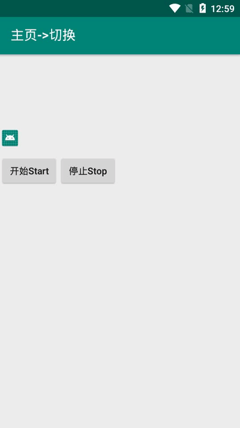
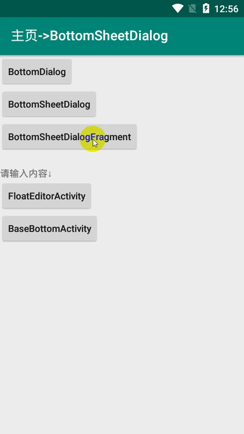
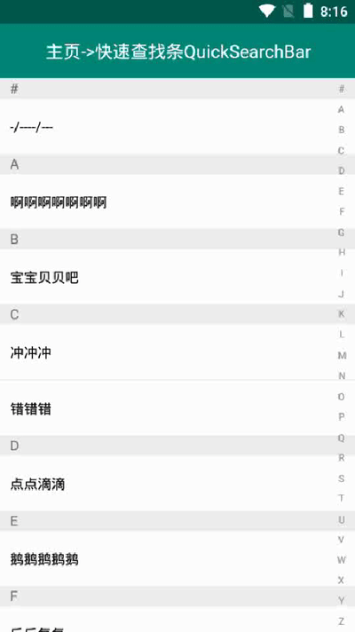
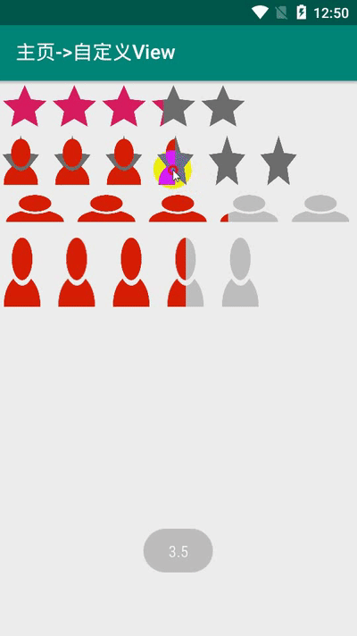

## MyAndroidFrameWork
> <a href="https://github.com/actor20170211030627/MyAndroidFrameWork" target="_blank"><s>Github(网速慢,不再维护 Deprecated)</s></a>  
> <a href="https://gitee.com/actor20170211030627/MyAndroidFrameWork" target="_blank">Gitee码云(国内网速更快)</a>
>
> 注意: 这是 <b>Androidx</b> 版, 非Androidx版本在&nbsp;
> <a style="font-size:23px" href="./README-1.4.1.md"><s>这儿 </s></a>
> &nbsp;(非Androidx版本不再维护)  
>
> > Androidx版本能很好向下兼容, 包括jar包依赖也能自动转换, 所以建议转换成Androidx.

## 安卓常用组件&框架(懒得每次都搭架子...)
### 1.集成框架包括如下列表, 具体见 <a href="library/build.gradle" target="_blank">build.gradle</a>:
<pre>
<ol><li>//https://github.com/google/gson converter-gson 已经依赖了Gson2.8.5
//不混淆解析类, 示例: -keep class com.package.xxx.info.** { *; }
//api 'com.google.code.gson:gson:2.8.5'
</li>
<li>//https://github.com/square/retrofit
api 'com.squareup.retrofit2:retrofit:2.9.0'
//https://github.com/square/retrofit/tree/master/retrofit-converters/gson
api 'com.squareup.retrofit2:converter-gson:2.9.0'
</li>
<li>//https://github.com/bumptech/glide
api 'com.github.bumptech.glide:glide:4.12.0'
</li>
<li>//https://github.com/greenrobot/EventBus
api 'org.greenrobot:eventbus:3.3.1'
</li>
<li>//https://github.com/Blankj/AndroidUtilCode 许多工具
api 'com.blankj:utilcodex:1.31.1'
</li>
<li>//https://github.com/CymChad/BaseRecyclerViewAdapterHelper
api 'com.github.CymChad:BaseRecyclerViewAdapterHelper:3.0.7'
</li>
<li>//https://gitee.com/getActivity/XXPermissions 轮子哥权限
//https://github.com/getActivity/XXPermissions
api 'com.github.getActivity:XXPermissions:16.6'
</li>
<li>//https://github.com/Bigkoo/Android-PickerView 时间选择器等等等
api 'com.contrarywind:Android-PickerView:4.1.9'
</li>
<li>//https://github.com/li-xiaojun/XPopup 各种Dialog & Popup (compileSdkVersion 29)
api 'com.github.li-xiaojun:XPopup:2.9.19'
</li>
<li>//https://github.com/square/okhttp
api "com.squareup.okhttp3:okhttp:4.9.2"
</li>
<li>//https://github.com/hongyangAndroid/okhttputils 张鸿洋的okhttp
api 'com.zhy:okhttputils:2.6.2'
</li></ol></pre>

## 2.一些控件和工具类等
**2.1.ViewPager的Adapter**
<pre>
<a href="library/src/main/java/com/actor/myandroidframework/adapter_viewpager/BaseFragmentPagerAdapter.java" target="_blank">BaseFragmentPagerAdapter</a>
<a href="library/src/main/java/com/actor/myandroidframework/adapter_viewpager/BaseFragmentStatePagerAdapter.java" target="_blank">BaseFragmentStatePagerAdapter</a>
<a href="library/src/main/java/com/actor/myandroidframework/adapter_viewpager/BasePagerAdapter.java" target="_blank">BasePagerAdapter</a>
</pre>

**2.2.Dialog(继承对应Dialog并自定义界面, 不用再关注style等. )**
<pre>
<a href="library/src/main/java/com/actor/myandroidframework/dialog/BaseAlertDialogV7.java" target="_blank">BaseAlertDialogV7</a> (V7包AlertDialog简单封装)
<a href="library/src/main/java/com/actor/myandroidframework/dialog/BaseBottomDialog.java" target="_blank">BaseBottomDialog</a> (从底部弹出并停留底部)
<a href="library/src/main/java/com/actor/myandroidframework/dialog/BaseBottomSheetDialog.java" target="_blank">BaseBottomSheetDialog</a> (从底部弹出并停留底部, 可二次滑动)
<a href="library/src/main/java/com/actor/myandroidframework/dialog/BaseDialog.java" target="_blank">BaseDialog</a> (Dialog简单封装)
<a href="library/src/main/java/com/actor/myandroidframework/dialog/BaseLeftDialog.java" target="_blank">BaseLeftDialog</a> (从左侧弹出的Dialog)
<a href="library/src/main/java/com/actor/myandroidframework/dialog/BaseRightDialog.java" target="_blank">BaseRightDialog</a> (从右侧弹出的Dialog)
<a href="library/src/main/java/com/actor/myandroidframework/dialog/BaseTopDialog.java" target="_blank">BaseTopDialog</a> (从顶部弹出的Dialog)
<a href="library/src/main/java/com/actor/myandroidframework/dialog/LoadingDialog.java" target="_blank">LoadingDialog</a> (加载Dialog, 耗时操作时可显示这个Dialog)
</pre>

**2.3.Utils工具类**
<pre>
<s><a href="library/src/main/java/com/actor/myandroidframework/utils/album/AlbumUtils.java" target="_blank">AlbumUtils</a> (选图片/选视频/拍照/录视频/预览图片)</s>
<a href="library/src/main/java/com/actor/myandroidframework/utils/audio/AudioUtils.java" target="_blank">AudioUtils</a> (录音/播放录音)
<a href="library/src/main/java/com/actor/myandroidframework/utils/baidu/BaiduLocationUtils.java" target="_blank">BaiduLocationUtils</a> (百度地图定位)
<a href="library/src/main/java/com/actor/myandroidframework/utils/baidu/BaiduMapUtils.java" target="_blank">BaiduMapUtils</a> (百度地图)
<a href="library/src/main/java/com/actor/myandroidframework/utils/database/GreenDaoUtils.java" target="_blank">GreenDaoUtils</a> (GreenDao数据库)
<s><a href="library/src/main/java/com/actor/myandroidframework/utils/database/SQLiteDatabaseUtils.java" target="_blank">SQLiteDatabaseUtils</a> (原生数据库)</s>
<a href="library/src/main/java/com/actor/myandroidframework/utils/gaode/GaoDeLocationUtils.java" target="_blank">GaoDeLocationUtils</a> (高德地图定位)
<a href="library/src/main/java/com/actor/myandroidframework/utils/gaode/GaoDeMapUtils.java" target="_blank">GaoDeMapUtils</a> (高德地图)
<a href="library/src/main/java/com/actor/myandroidframework/utils/gaode/GaoDeUiSettingUtils.java" target="_blank">GaoDeUiSettingUtils</a> (高德地图UI界面)
<a href="library/src/main/java/com/actor/myandroidframework/utils/gson/IntJsonDeserializer.java" target="_blank">IntJsonDeserializer</a> (解决Gson""转换成int报错)
<a href="library/src/main/java/com/actor/myandroidframework/utils/jpush/JPushUtils.java" target="_blank">JPushUtils</a> (极光推送)
<a href="library/src/main/java/com/actor/myandroidframework/utils/mpchart/BarChartUtils.java" target="_blank">BarChartUtils</a> (柱状图)
<a href="library/src/main/java/com/actor/myandroidframework/utils/mpchart/LineChartUtils.java" target="_blank">LineChartUtils</a> (折线图)
<a href="library/src/main/java/com/actor/myandroidframework/utils/okhttputils/MyOkHttpUtils.java" target="_blank">MyOkHttpUtils</a> (Okhttp网络请求)
<a href="library/src/main/java/com/actor/myandroidframework/utils/retrofit/RetrofitNetwork.java" target="_blank">RetrofitNetwork</a> (retrofit简单封装)
<a href="library/src/main/java/com/actor/myandroidframework/utils/sharedelement/SharedElementUtils.java" target="_blank">SharedElementUtils</a> (元素共享跳转页面)
<a href="library/src/main/java/com/actor/myandroidframework/utils/tencent/QQUtils.java" target="_blank">QQUtils</a> (QQ登录, 获取用户信息, 分享图文/图片/音乐/App/文件, 唤起小程序/小游戏...)
<a href="library/src/main/java/com/actor/myandroidframework/utils/tencent/WeChatUtils.java" target="_blank">WeChatUtils</a> (微信登录, 获取Token, 分享文字/图片/音乐/视频/网页/小程序/文件, 支付, 订阅消息...)
<a href="library/src/main/java/com/actor/myandroidframework/utils/video/VideoProcessorUtils.java" target="_blank">VideoProcessorUtils</a> (视频压缩)
<a href="library/src/main/java/com/actor/myandroidframework/utils/AssetsUtils.java" target="_blank">AssetsUtils</a> (Assets读取)
<a href="library/src/main/java/com/actor/myandroidframework/utils/BirthdayUtils.java" target="_blank">BirthdayUtils</a> (生日: 天数倒数, 农历生日, 年龄)
<a href="library/src/main/java/com/actor/myandroidframework/utils/BRVUtils.java" target="_blank">BRVUtils</a> (BaseRecyclerView框架辅助)
<a href="library/src/main/java/com/actor/myandroidframework/utils/ClickUtils2.java" target="_blank">ClickUtils2</a> (防止2次点击)
<a href="library/src/main/java/com/actor/myandroidframework/utils/LogUtils.java" target="_blank">LogUtils</a> (Log简单打印)
<a href="library/src/main/java/com/actor/myandroidframework/utils/NotificationHelper.java" target="_blank">NotificationHelper</a> (通知栏)
<a href="library/src/main/java/com/actor/myandroidframework/utils/SPUtils.java" target="_blank">SPUtils</a> (SP工具)
<a href="library/src/main/java/com/actor/myandroidframework/utils/TextUtils2.java" target="_blank">TextUtils2</a> (获取Text, 判空, getStringFormat, ...)
<a href="library/src/main/java/com/actor/myandroidframework/utils/ThreadUtils.java" target="_blank">ThreadUtils</a> (线程判断/切换)
</pre>

**2.4.Widget小控件**
<pre>
<a href="library/src/main/java/com/actor/myandroidframework/widget/chat/VoiceRecorderView.java" target="_blank">VoiceRecorderView</a> (低仿微信录音)
<a href="library/src/main/java/com/actor/myandroidframework/widget/NineGridView/NineGridView.java" target="_blank">NineGridView</a> (九宫格)
<a href="library/src/main/java/com/actor/myandroidframework/widget/viewpager/AutoCaculateHeightViewpager.java" target="_blank">AutoCaculateHeightViewpager</a> (自动计算子类高度的ViewPager)
<a href="library/src/main/java/com/actor/myandroidframework/widget/viewpager/ScrollableViewPager.java" target="_blank">ScrollableViewPager</a> (ViewPager是否能左右滑动)
<a href="library/src/main/java/com/actor/myandroidframework/widget/webview/BaseWebView.java" target="_blank">BaseWebView</a> (WebView简单封装)
<a href="library/src/main/java/com/actor/myandroidframework/widget/BaseItemDecoration.java" target="_blank">BaseItemDecoration</a> (RecyclerView的Item间隔)
<a href="library/src/main/java/com/actor/myandroidframework/widget/BaseRadioGroup.java" target="_blank">BaseRadioGroup</a> (RadioGroup简单封装)
<a href="library/src/main/java/com/actor/myandroidframework/widget/BaseRatingBar.java" target="_blank">BaseRatingBar</a> (RatingBar星星选择)
<a href="library/src/main/java/com/actor/myandroidframework/widget/BaseSlidingDrawer.java" target="_blank">BaseSlidingDrawer</a> (抽屉, 从底部或左侧拉出/收回)
<a href="library/src/main/java/com/actor/myandroidframework/widget/BaseSpinner.java" target="_blank">BaseSpinner</a> (Spinner增加一些属性)
<a href="library/src/main/java/com/actor/myandroidframework/widget/BaseTabLayout.java" target="_blank">BaseTabLayout</a> (更简单使用TabLayout)
<a href="library/src/main/java/com/actor/myandroidframework/widget/BaseTextSwitcher.java" target="_blank">BaseTextSwitcher</a> (TextView切换)
<a href="library/src/main/java/com/actor/myandroidframework/widget/BaseViewSwitcher.java" target="_blank">BaseViewSwitcher</a> (View切换)
<a href="library/src/main/java/com/actor/myandroidframework/widget/ItemRadioGroupLayout.java" target="_blank">ItemRadioGroupLayout</a> (RadioGroup选择)
<a href="library/src/main/java/com/actor/myandroidframework/widget/ItemSpinnerLayout.java" target="_blank">ItemSpinnerLayout</a> (Spinner选择)
<a href="library/src/main/java/com/actor/myandroidframework/widget/ItemTextInputLayout.java" target="_blank">ItemTextInputLayout</a> (Text输入)
<a href="library/src/main/java/com/actor/myandroidframework/widget/QuickSearchBar.java" target="_blank">QuickSearchBar</a> (快速查找条a-z)
<a href="library/src/main/java/com/actor/myandroidframework/widget/RatioLayout.java" target="_blank">RatioLayout</a> (百分比布局, 宽高百分比)
<a href="library/src/main/java/com/actor/myandroidframework/widget/RoundCardView.java" target="_blank">RoundCardView</a> (圆角CardView)
<a href="library/src/main/java/com/actor/myandroidframework/widget/StatusBarHeightView.java" target="_blank">StatusBarHeightView</a> (状态栏占高)
<a href="library/src/main/java/com/actor/myandroidframework/widget/SwipeRefreshLayoutCompatViewPager.java" target="_blank">SwipeRefreshLayoutCompatViewPager</a> (SwipeRefreshLayout适配ViewPager里的下拉)
</pre>

## 3.Screenshot
</img>
</img>  
</img>
</img>

## 4.Sample
<a href="app/build/outputs/apk/debug/app-debug.apk" target="_blank">download apk</a>

## 5.minSdkVersion 
    如果您项目的minSdkVersion小于21, 集成后可能会报错: Manifest merger failed with multiple errors, see logs

## 6.How to
To get a Git project into your build:

**Step 1.** Add the JitPack repository to your build file

Add it in your root build.gradle at the end of repositories:
<pre>
    allprojects {
        repositories {
            ...
            maven { url 'https://jitpack.io' }
        }
    }
</pre>

**Step 2.** Add the dependency, the last version(最新版本):
<s>Github:</s> &nbsp; Gitee: 
<pre>
    android {
      ...
      compileOptions {
        sourceCompatibility JavaVersion.VERSION_1_8
        targetCompatibility JavaVersion.VERSION_1_8
      }
    }

    dependencies {
            //需要在自己项目中集成constraint包, 版本version>=1.1.3
            implementation 'androidx.constraintlayout:constraintlayout:version xxx'

            //https://gitee.com/actor20170211030627/MyAndroidFrameWork
            implementation 'com.gitee.actor20170211030627.MyAndroidFrameWork:library:gitee's last version'
            <s>implementation 'com.github.actor20170211030627.MyAndroidFrameWork:myandroidframework:github's last version'(不再维护 Deprecated)</s>

            /**
             * 如果需要图片(裁剪,压缩,自定义相机)、视频、音频的选择和预览, 拍照/拍视频/录音频, 需要添加以下依赖(使用的是 <a href="https://github.com/LuckSiege/PictureSelector" target="_blank">PictureSelector</a> 框架)
             * 并可使用: <a href="picture_selector/src/main/java/com/actor/myandroidframework/utils/picture_selector/PictureSelectorUtils.java" target="_blank">PictureSelectorUtils.java</a>
             * <a href="picture_selector/src/main/java/com/actor/myandroidframework/adapter_recyclerview/AddAudioAdapter.java" target="_blank">AddAudioAdapter(选择添加音频)</a>
             * <a href="picture_selector/src/main/java/com/actor/myandroidframework/adapter_recyclerview/AddPicAdapter.java" target="_blank">AddPicAdapter(选择添加图片)</a>
             * <a href="picture_selector/src/main/java/com/actor/myandroidframework/adapter_recyclerview/AddVideoAdapter.java" target="_blank">AddVideoAdapter(选择添加视频)</a>
             */
            implementation 'com.gitee.actor20170211030627.MyAndroidFrameWork:picture_selector:gitee's last version'
            // 图片压缩 (按需引入): 如果你选择图片/拍照后, 需要使用压缩图片功能, 需要添加下面这行依赖
            implementation 'io.github.lucksiege:compress:v3.10.8'
            // 图片裁剪 (按需引入)
            implementation 'io.github.lucksiege:ucrop:v3.10.8'
            // 自定义相机 (按需引入)
            implementation 'io.github.lucksiege:camerax:v3.10.8'
    }
</pre>

## 7.<code>AndroidManifest.xml</code>合并清单文件报错
    1.如果报错: AndroidManifest.xml:15:5-134:19: AAPT: error: attribute android:requestLegacyExternalStorage not found.
      需要将 compileSdkVersion 升级到 29

## 8.项目中已经添加了混淆文件, 如果需要混淆, 只需在自己项目中打开混淆配置:
<pre>
    android {
        ...
        buildTypes {
            release {
                minifyEnabled true
                ...
            }
        }
    }
</pre>

## 9.使用步骤
<pre>
1.写一个 Application extends ActorApplication, 然后重写方法, 可参考: <a href="app/src/main/java/com/actor/sample/MyApplication.java" target="_blank">MyApplication</a>  (非必须继承, ActorApplication里有一些配置, 可把配置代码copy到自己Application)
2.写一个 BaseActivity extends ActorBaseActivity, 然后你的Activity 继承 BaseActivity (非必须继承)
3.写一个 BaseFragment extends ActorBaseFragment, 然后你的Fragment 继承 BaseFragment (非必须继承)
4.&lt;style name="AppTheme" parent="AppThemeForMyAndroidFrameWork"> 你的style可继承这个style (非必须继承)
</pre>

## 10.有问题请升级到最新版本: <s>Github:</s> Gitee: , 或提交 <a href="https://gitee.com/actor20170211030627/MyAndroidFrameWork/issues" target="_blank">issues</a>, 或发邮箱: <a href="mailto:1455198886@qq.com">email</a>

## 11.License

